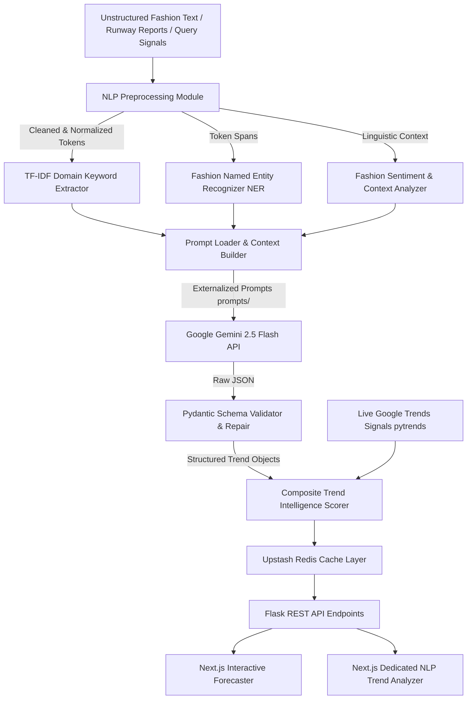

# AI-Powered Fashion Trend Intelligence & Forecasting System

[](https://www.python.org/)
[](https://nextjs.org/)
[](https://flask.palletsprojects.com/)
[](https://ai.google.dev/)
[](https://scikit-learn.org/)
[](https://docs.pydantic.dev/)

An advanced **Natural Language Processing (NLP)** and **Large Language Model (LLM)** intelligence platform designed to extract, evaluate, and forecast apparel trends specifically for the Indian fashion ecosystem.

---

## 📌 1. Project Overview & Problem Statement

### The Problem
Traditional fashion forecasting in South Asia relies on manual editorial curation or lagging sales data, leading to **inventory miscalculations, deadweight stock, and poor translation of regional aesthetics into commercial retail**. Simultaneously, digital fashion discourse (social media captions, runway reviews, fashion journalism) contains high-velocity early trend signals that remain unstructured and unquantified.

### The Solution
The **AI-Powered Fashion Trend Intelligence & Forecasting System** combines:
1. **Linguistic NLP Preprocessing & Domain Tokenization**: Cleans unstructured fashion text and analyzes vocabulary distributions.
2. **Domain-Weighted TF-IDF Keyword Extraction**: Boosts Indian regional craft, silhouette, and textile terminology.
3. **Fashion Named Entity Recognition (NER)**: Identifies garments, regional crafts (e.g. *Chikankari*, *Bandhani*, *Ajrakh*), fabrics, aesthetics, and colors across 6 structured categories.
4. **Google Gemini LLM Semantic Extraction**: Grounded semantic analysis utilizing structured external prompt templates and strict Pydantic output validation.
5. **Multi-Signal Trend Intelligence Scoring**: Combines live Google Trends search momentum, NLP prominence, semantic confidence, and sentiment valence into a transparent 0–100 index.
6. **Dual-Interface Web Application**: A Next.js interactive visual forecasting dashboard and a dedicated real-time NLP Trend Analyzer.

---

## 🏗️ 2. System Architecture



---

## 🔬 3. Core NLP Pipeline Modules

The modular NLP pipeline is organized under [`backend/nlp/`](file:///backend/nlp/):

| Module | File | Academic Functionality |
| :--- | :--- | :--- |
| **Preprocessing & Tokenization** | [`preprocessing.py`](file:///backend/nlp/preprocessing.py) | Text cleaning (regex, unicode normalization), custom fashion stopword filtering, domain lemmatization dictionary, lexical diversity calculation. |
| **TF-IDF Keyword Extraction** | [`keyword_extractor.py`](file:///backend/nlp/keyword_extractor.py) | Scikit-Learn TF-IDF vectorization boosted with a curated Indian & global fashion taxonomy (Crafts: 1.5x, Silhouettes: 1.3x, Aesthetics: 1.3x). |
| **Fashion NER** | [`entity_extractor.py`](file:///backend/nlp/entity_extractor.py) | Rule-based & boundary regex entity recognition across 6 categories: `Garments`, `Indian Crafts`, `Fabrics`, `Aesthetics`, `Colors`, and `Demographics`. |
| **Sentiment & Context** | [`sentiment.py`](file:///backend/nlp/sentiment.py) | Evaluates commercial adoption momentum (Bullish / Stable / Bearish) and classifies stylistic context (Runway, Streetwear, Festive, Sustainable). |
| **NLP Orchestrator** | [`analyzer.py`](file:///backend/nlp/analyzer.py) | Coordinates the end-to-end linguistic pipeline and profiles millisecond execution latency. |

---

## 🧠 4. LLM Integration & Prompt Engineering

The system integrates Google Gemini via official SDK calls (`google-genai`) under [`backend/llm/`](file:///backend/llm/):

- **External Prompt Architecture ([`prompts/`](file:///prompts/))**: Prompts are stored in dedicated `.txt` template files, separating prompt design from Python code.
  - [`trend_extraction.txt`](file:///prompts/trend_extraction.txt): Anti-hallucination evidence extraction and entity grounding.
  - [`trend_analysis.txt`](file:///prompts/trend_analysis.txt): Deep semantic analysis of consumer drivers and retail advice.
  - [`forecast_generation.txt`](file:///prompts/forecast_generation.txt): 5-year trend adoption trajectory projection.
- **Pydantic Schema Validation ([`schemas.py`](file:///backend/llm/schemas.py))**: All LLM responses are parsed and validated against strict Pydantic schemas (`TrendExtractionResponse`, `ExtractedTrendItem`).
- **Resilience & Graceful Degradation ([`gemini_client.py`](file:///backend/llm/gemini_client.py))**:
  - Automatic JSON cleaning (markdown block strip, regex extraction).
  - Retry logic on transient network or API failure.
  - Deterministic NLP heuristic fallback mode if `GEMINI_API_KEY` is not provided.

---

## 📊 5. Trend Intelligence Scoring Methodology

The transparent composite **Trend Intelligence Score ($S_{trend} \in [0, 100]$)** combines 5 distinct signals:

$$S_{trend} = (w_{gt} \cdot M_{gt}) + (w_{nlp} \cdot P_{nlp}) + (w_{sem} \cdot C_{sem}) + (w_{sent} \cdot V_{sent}) + (w_{src} \cdot D_{src})$$

- $M_{gt}$ (30%): Google Trends search velocity & momentum index.
- $P_{nlp}$ (25%): TF-IDF domain taxonomy prominence.
- $C_{sem}$ (20%): Semantic LLM confidence and evidence strength.
- $V_{sent}$ (15%): Sentiment valence & adoption context momentum.
- $D_{src}$ (10%): Multi-channel source cross-verification.

### Trend Stage Classification
- **Emerging ($\ge 75$)**: Early-stage cultural signal with explosive search velocity and niche adoption.
- **Growing ($55 - 74$)**: Accelerating consumer demand transitioning from runway/digital into mass retail.
- **Stable ($35 - 54$)**: Mature wardrobe staple with steady baseline volume and predictable seasonal peaks.
- **Declining ($< 35$)**: Saturating trend experiencing plateaued search momentum.

---

## ⚙️ 6. System Configuration ([`config/config.yaml`](file:///config/config.yaml))

All operational parameters are centrally defined in YAML:

```yaml
system:
  name: "AI-Powered Fashion Trend Intelligence & Forecasting System"
  version: "2.0.0"

llm:
  provider: "google"
  model: "gemini-2.5-flash"
  temperature: 0.2
  max_output_tokens: 2048
  retry_count: 2

nlp:
  tfidf:
    max_features: 50
    ngram_range: [1, 2]
  keyword_limit: 15

forecasting:
  trend_score_weights:
    google_trends_momentum: 0.30
    nlp_keyword_prominence: 0.25
    semantic_confidence: 0.20
    sentiment_valence: 0.15
    source_diversity: 0.10

caching:
  enabled: true
  ttl_seconds: 86400
```

---

## 🔌 7. REST API Endpoints

| Method | Endpoint | Description |
| :--- | :--- | :--- |
| `GET` | `/` | System health check and academic architecture overview. |
| `GET` | `/api/config` | Retrieves non-sensitive system settings and active feature flags. |
| `POST` | `/api/analyze` | **Dedicated NLP Endpoint:** Accepts raw text, executes NLP + LLM extraction, returns keywords, NER entities, sentiment, and scored trends. |
| `POST` | `/api/forecast` | Multi-signal interactive forecasting endpoint with Google Trends and Redis caching. |

---

## 🚀 8. Installation & Quick Start

### Prerequisites
- Python 3.10+
- Node.js 18+ & npm
- Google Gemini API Key (*optional, fallback mode included*)

### Step 1: Clone Repository & Setup Environment
```bash
git clone https://github.com/devisha-jain/Fashion-Forcasting-Lab.git
cd Fashion-Forcasting-Lab
```

### Step 2: Configure Environment Variables
Copy `.env.example` to `.env`:
```bash
cp .env.example .env
```
*(Optionally add your `GEMINI_API_KEY` to `.env`)*

### Step 3: Backend Setup & Run
```bash
# Create and activate Python virtual environment
python -m venv venv

# Windows:
.\venv\Scripts\activate
# macOS/Linux:
source venv/bin/activate

# Install Python dependencies
pip install -r backend/requirements.txt

# Run Flask Backend Server (Port 5000)
python -m flask --app backend/app.py run --port 5000
```

### Step 4: Frontend Setup & Run
Open a second terminal window:
```bash
cd frontend

# Install Node dependencies
npm install

# Run Next.js Dev Server (Port 3000)
npm run dev
```

### Step 5: Open in Browser
- **Forecaster Dashboard:** [http://localhost:3000](http://localhost:3000)
- **NLP Trend Analyzer:** [http://localhost:3000/analyze](http://localhost:3000/analyze)
- **Backend API Status:** [http://localhost:5000](http://localhost:5000)

---

## ☁️ 9. Deployment to Vercel

The repository is configured for unified serverless deployment via root [`vercel.json`](file:///vercel.json):

1. **Push your code to GitHub**:
   ```bash
   git add .
   git commit -m "Deploy to Vercel"
   git push origin main
   ```
2. **Import Project in Vercel**:
   - Go to [vercel.com](https://vercel.com) → **Add New Project**.
   - Select your GitHub repository (`Fashion-Forcasting-Lab`).
   - Leave Root Directory as `./` (default).
3. **Configure Environment Variables**:
   In Vercel Project Settings → **Environment Variables**, add:
   - `GEMINI_API_KEY`: *(Required)* Your Google Gemini API key.
   - `UNSPLASH_ACCESS_KEY`: *(Optional)* Unsplash developer key for live moodboard images.
   - `ALLOWED_ORIGINS`: `*` (or your production Vercel domain).
4. **Deploy**:
   - Vercel automatically builds both Next.js (`frontend/package.json`) and the Python Flask serverless function (`backend/app.py`), routing `/api/*` requests directly to Flask.

---

## 🧪 10. Running Tests

Execute the automated test suite to verify the NLP pipeline, keyword extraction, NER, sentiment analyzer, scoring, and prompt loaders:
```bash
python -m unittest discover -s backend/tests -p "test_*.py"
```

---

## 💡 10. Viva / Academic Defense Key Points

When presenting this project for NLP & LLM course evaluation:
1. **Why is this an NLP project?** It implements text normalization, domain lemmatization, TF-IDF feature extraction with domain weights, custom 6-category fashion Named Entity Recognition, and adoption sentiment analysis.
2. **How is the LLM integrated meaningfully?** Rather than generating generic chat text, Gemini is used as a **semantic extraction engine**. It converts raw unstructured fashion discourse into strict, validated Pydantic JSON objects representing grounded trends, drivers, and silhouette breakdowns.
3. **What is the prompt engineering strategy?** Prompt templates are externalized in `prompts/`, implementing explicit role assignment, anti-hallucination evidence grounding constraints, and deterministic JSON schemas.
4. **How is code efficiency ensured?** Single-pass batch extraction, MD5-hashed Redis caching with 24-hour TTL, real-time latency measurement, and graceful deterministic offline fallback algorithms.

---

## 📜 License
This project is developed for academic and educational purposes under the MIT License.
